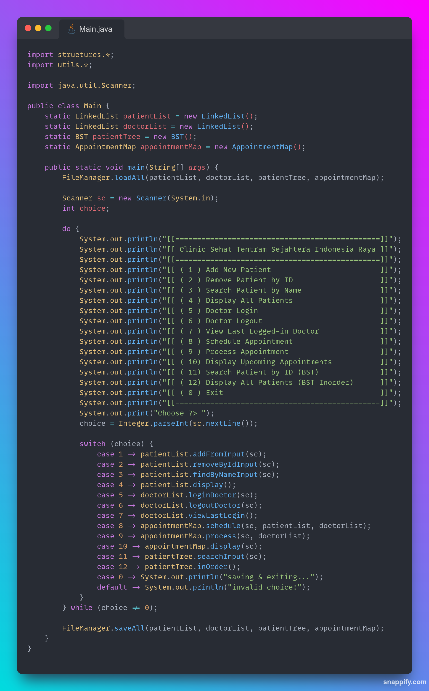
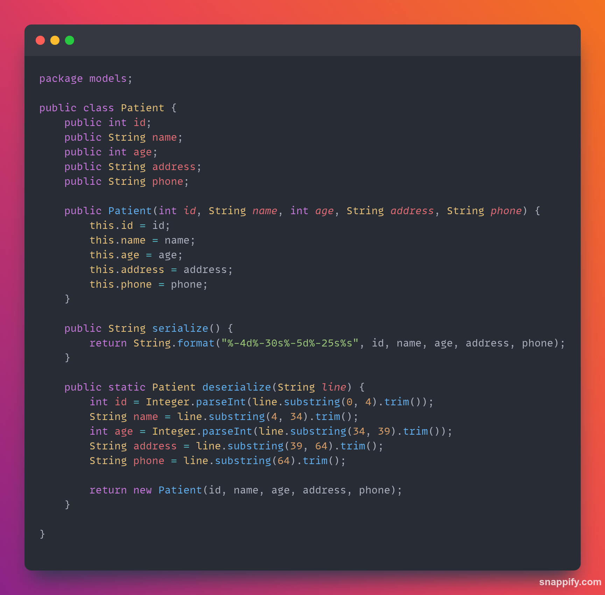
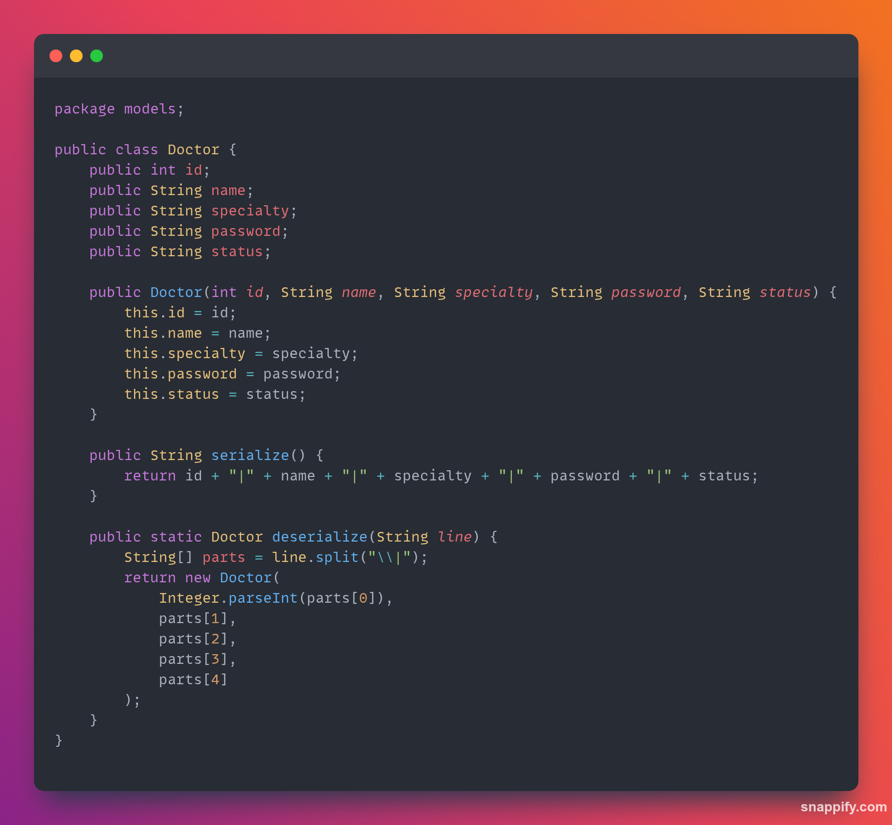
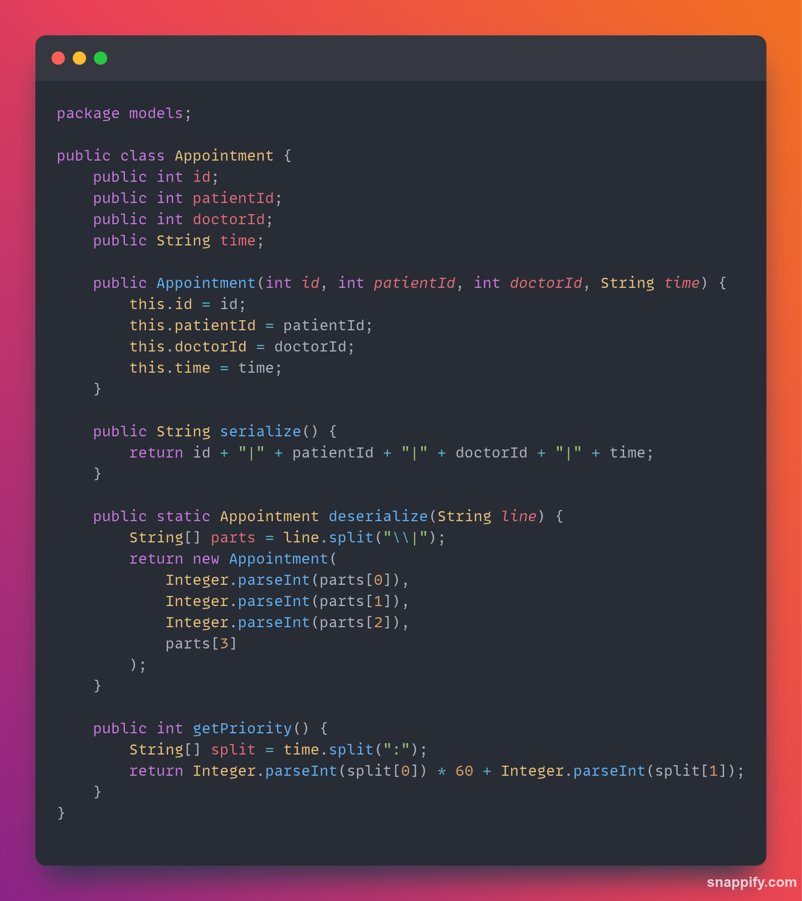
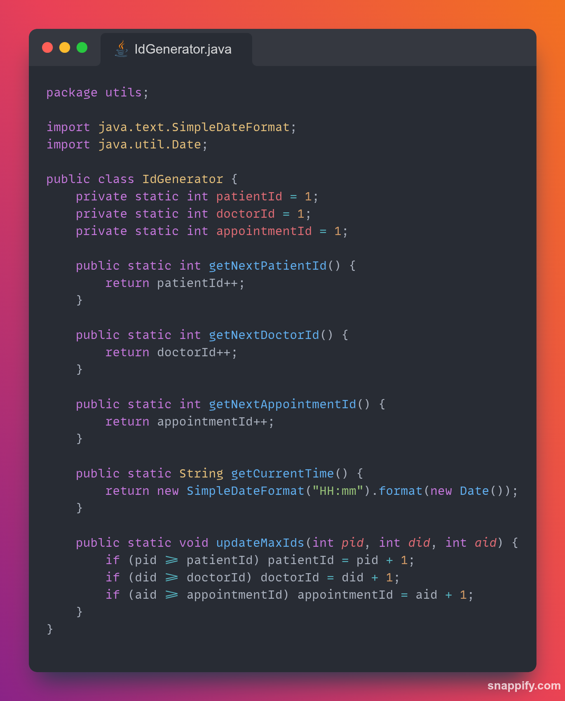
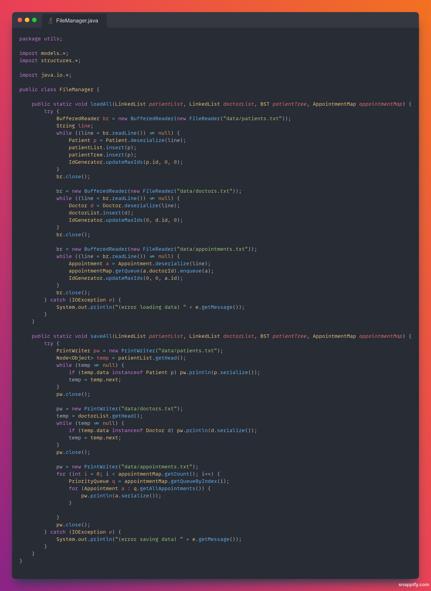

# Clinic Sehat Tentram Sejahtera Indonesia Raya

`Clinic Sehat Tentram Sejahtera Indonesia Raya` adalah sebuah aplikasi berbasis terminal (Command Line Interface) yang dirancang untuk membantu manajemen klinik secara sederhana namun efisien. Program ini dibangun menggunakan bahasa pemrograman Java tanpa bantuan build tools (e.g. Maven atau Gradle), dan menggunakan struktur folder manual (`src`, `bin`, dll) dan menggunakan txt file sebagai [penyimpanan data](#️-manajemen-data).

---

## Table of Content

- [Anggota Kelompok](#-anggota-kelompok)
- [Struktur Folder](#-struktur-folder)
- [Manajemen Data](#-manajemen-data)
- [Penjelasan Kode](#-penjelasan-kode)
- [Cara Menjalankan Program Ini](#-cara-menjalankan-program-ini)

---

## 👨🏻‍💻 Anggota Kelompok

1. Faris Syahrul Muhammad (L0124053)
2. Ihsan Restu Adi (L0124058)
*3. Andika Bahari Suryanegara (L0124087)*
*4. Aisyah Nurul Sholikhah (L0124085)*

---

## 📂 Struktur Folder

```
dsa-clinic/
├── .vscode/                
│   → Pengaturan editor (opsional)
├── lib/                    
│   → Kosong / opsional
├── bin/                    
│   → file hasil kompilasi akan berada disini
├── assets/                    
│   → gambar untuk keperluan markdown file
├── src/ 
│   ├── models/    
│   │   ├── Doctor.java              
│   │   ├── Appointment.java    
│   │   └── Patient.java    
│   ├── structures/    
│   │   ├── AppointmentMap.java              
│   │   ├── BST.java    
│   │   ├── LinkedList.java       
│   │   ├── Node.java       
│   │   └── PriorityQueue.java       
│   ├── utils/    
│   │   ├── FileManager.java              
│   │   └── IdGenerator.java                   
│   └── Main.java 
├── .gitignore              
└── README.md                  
```

---

## 🗃️ Manajemen Data

Program ini menggunakan file `.txt` sebagai tempat penyimpanan data utama (persisten). Saat program dijalankan, data akan **dibaca dari file** dan dimasukkan ke dalam **struktur data di memori** seperti `LinkedList`, `BST`, dan `Map`.

🧠 Selama program berjalan, semua operasi seperti menambah pasien, login dokter, atau menjadwalkan appointment akan **diproses di dalam variabel memori** – bukan langsung ke file.

📦 Setelah pengguna memilih keluar dari program (`exit`), semua data di memori akan **disimpan kembali ke file `.txt`**, sehingga data tetap aman dan tersedia saat program dijalankan kembali nanti.

---

# 🧩 Penjelasan Kode

## `Main.java` - Entry Point
<p align="center">
  
  <br/>
</p>


File `Main.java` adalah titik masuk utama (entry point) dari aplikasi **Daisuke Clinic**, sebuah sistem manajemen klinik berbasis Command Line Interface (CLI) yang dibuat dengan Java. File ini bertanggung jawab atas alur utama program dan interaksi pengguna melalui menu terminal.

### 📌 Ringkasan Fungsi

- **Load Data Awal:** Mengambil data dari file menggunakan `FileManager.loadAll()` ke dalam struktur data internal seperti `LinkedList`, `BST`, dan `AppointmentMap`.
- **Menu Utama:** Menampilkan menu pilihan kepada pengguna menggunakan sistem perulangan `do-while`.
- **Pemrosesan Input:** Menerima dan memproses pilihan pengguna menggunakan struktur `switch-case` modern (Java 14+).
- **Fungsi Klinik:** Menyediakan berbagai fitur untuk mengelola data pasien, login/logout dokter, jadwal janji temu, dan operasi dengan pohon BST.
- **Simpan Data Akhir:** Menyimpan seluruh data kembali ke file dengan `FileManager.saveAll()` saat pengguna memilih keluar (`choice == 0`).

### 📌 Struktur Data yang Digunakan

- `LinkedList`: Menyimpan daftar pasien (`patientList`) dan dokter (`doctorList`).
- `BST` (Binary Search Tree): Menyimpan data pasien berdasarkan ID untuk pencarian yang lebih cepat.
- `AppointmentMap`: Mengelola penjadwalan dan pemrosesan janji temu pasien berdasarkan dokter.


Blok kode ini merupakan pusat pengontrol dari seluruh fitur sistem klinik dan mengatur bagaimana interaksi antar struktur data berlangsung melalui antarmuka terminal.

---

## 📁 `src/models` - Model Untuk Beberapa Data

<p align="center">
  
  
  
  <br/>
</p>

Folder `models/` berisi **representasi data utama** dalam sistem Daisuke Clinic. File-file di dalam folder ini mendefinisikan struktur dan perilaku objek penting seperti pasien, dokter, dan janji temu. Kelas-kelas ini digunakan di berbagai struktur data (`LinkedList`, `BST`, `AppointmentMap`) untuk menyimpan dan memanipulasi data secara efisien.

### 📄 `Patient.java`
Kelas ini merepresentasikan **data pasien** dalam sistem.

#### Atribut umum:
- `id` – ID pasien (unik)
- `name` – Nama pasien
- `age` – Umur pasien

#### Fitur:
- Constructor untuk inisialisasi objek
- Getter dan setter untuk manipulasi data
- `toString()` untuk menampilkan data pasien dengan format yang rapi

---

### 📄 `Doctor.java`
Kelas ini menyimpan data dan perilaku **dokter** yang tersedia di sistem.

#### Atribut umum:
- `id` – ID dokter
- `name` – Nama dokter
- `specialty` – Spesialisasi medis
- `password` – Kata sandi untuk login

#### Fitur:
- Login dan logout dengan autentikasi sederhana
- Penyimpanan status login terakhir
- `toString()` untuk menampilkan data dokter

---

### 📄 `Appointment.java`
Kelas ini merepresentasikan **janji temu** antara pasien dan dokter.

#### Atribut umum:
- `patient` – Objek pasien yang membuat janji
- `doctor` – Objek dokter tujuan
- `time` – Jam janji temu dengan format (HH:mm)

#### Fitur:
- Constructor untuk membuat janji temu baru
- Akses data pasien & dokter yang terkait
- Digunakan dalam `AppointmentMap` untuk pengelolaan antrian janji temu per dokter

---

Kelas-kelas dalam `models/` ini adalah pondasi utama dari data yang dikelola sistem. Struktur mereka sederhana namun cukup fleksibel untuk diperluas jika proyek berkembang di masa depan.

---

## 📁 `structures/` - Struktur Data Kustom

Folder ini berisi **struktur data buatan sendiri** yang digunakan untuk menyimpan dan memproses pasien, dokter, dan janji temu.

### 📄 `LinkedList.java`
- Implementasi linked list sederhana (single-linked list).
- Menyimpan data pasien dan dokter.
- Mendukung operasi tambah, hapus, cari, dan tampilkan.

### 📄 `Node.java`
- Kelas simpul (`node`) untuk digunakan dalam `LinkedList`, `BST`, dan lainnya.
- Menyimpan data generik (`Object data`) dan referensi ke simpul berikutnya.

### 📄 `BST.java` (Binary Search Tree)
- Menyimpan data pasien berdasarkan ID.
- Memungkinkan pencarian pasien yang efisien.
- Mendukung operasi `insert`, `search`, dan `inOrder` traversal.

### 📄 `AppointmentMap.java`
- Menyimpan daftar janji temu berdasarkan dokter.
- Mirip seperti `Map<Doctor, Queue<Appointment>>`.
- Berisi fitur untuk menjadwalkan dan memproses janji temu.

### 📄 `PriorityQueue.java`
- Antrian dengan **prioritas**, digunakan dalam penjadwalan janji temu.
- Pasien dapat diatur berdasarkan prioritas (misal: umur, penyakit, urutan waktu).
- Tidak menggunakan `java.util.PriorityQueue`.

---

## 📁 `utils/` - Kelas Pendukung/Pembantu

<p align="center">
  
  
  <br/>
</p>

Folder ini berisi kelas-kelas **utility/helper** untuk mendukung operasi umum dalam aplikasi.

### 📄 `FileManager.java`
- Bertanggung jawab untuk **membaca dan menulis** data ke file `.txt`.
- Memuat dan menyimpan data pasien, dokter, BST, dan appointment ke file saat program dijalankan/ditutup.

### 📄 `IdGenerator.java`
- Menghasilkan ID unik untuk pasien dan dokter.
- Menjaga agar tidak terjadi duplikasi ID.
- Biasanya menggunakan counter sederhana yang meningkat tiap pembuatan data baru.

---

Struktur folder ini dirancang untuk modularitas, keterbacaan, dan untuk melatih pemahaman konsep struktur data serta manajemen file tanpa library eksternal.

---

## 🚀 Cara Menjalankan Program Ini

Proyek ini dibuat **tanpa menggunakan build tools** seperti Maven atau Gradle. Struktur folder menggunakan pendekatan manual:

```
📁 src/   → berisi file sumber Java
📁 bin/   → tempat menyimpan file hasil kompilasi
```

### 🔧 Persyaratan
- **Git** – untuk meng-clone repository
- **Java Development Kit (JDK) versi 21 atau lebih baru**
- OS Linux/macOS/Windows dengan terminal
- Sudah mengatur `JAVA_HOME` dan menambahkan `javac` serta `java` ke dalam `PATH`

---

### 📥 1. Clone Repository

```bash
git clone https://github.com/ihsanlearn/dsa-clinic.git
cd dsa-clinic
```

---

### 🏗️ 2. Kompilasi Semua File Java

```bash
javac --enable-preview -d bin -cp src $(find src -name "*.java")
```

> Penjelasan:
> - `--enable-preview` : digunakan jika kamu memakai fitur preview Java (seperti pattern matching, dsb)
> - `-d bin` : hasil kompilasi akan disimpan ke folder `bin`
> - `-cp src` : menyetel classpath ke folder `src`
> - `$(find src -name "*.java")` : mencari semua file `.java` dari folder `src` secara rekursif

---

### ▶️ 3. Jalankan Program

```bash
java --enable-preview -cp bin Main
```

> Jika file `Main.java` berada dalam package (misalnya `package app;`), maka gunakan:
```bash
java --enable-preview -cp bin app.Main
```

---

### 📌 Catatan Tambahan

- Program ini belum sepenuhnya memiliki validasi yang matang.
- Jika folder `bin/` belum ada, akan otomatis dibuat saat proses kompilasi.
- Pastikan tidak ada error selama kompilasi agar program dapat berjalan dengan baik.
- Simpan data `.txt` yang digunakan oleh program (jika ada) di lokasi yang sesuai (biasanya di root project atau `data/` folder jika kamu membuatnya sendiri).

---

### 💡 Tips Opsional (Shell Script)

Kamu bisa membuat file bernama `run.sh` untuk compile & run secara otomatis:

```bash
#!/bin/bash
javac --enable-preview -d bin -cp src $(find src -name "*.java")
java --enable-preview -cp bin Main
```

Lalu jalankan:

```bash
chmod +x run.sh
./run.sh
```

---

Selamat mencoba Clinic Sehat Tentram Sejahtera Indonesia Raya! 🩺